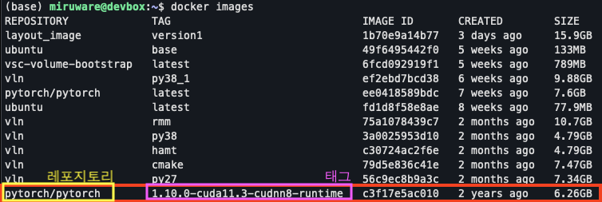
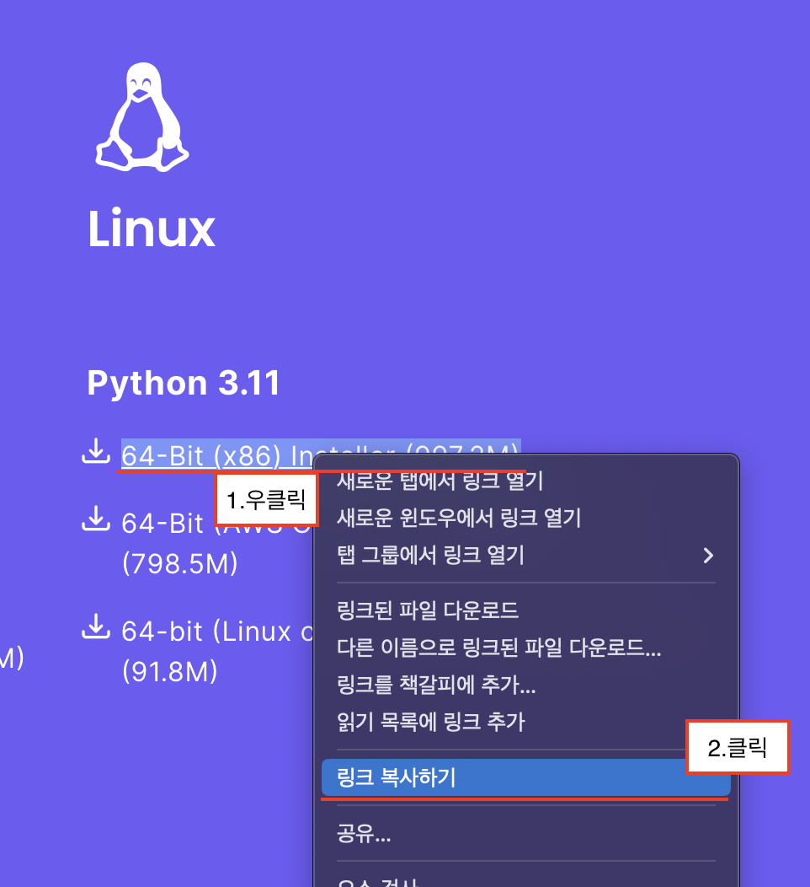
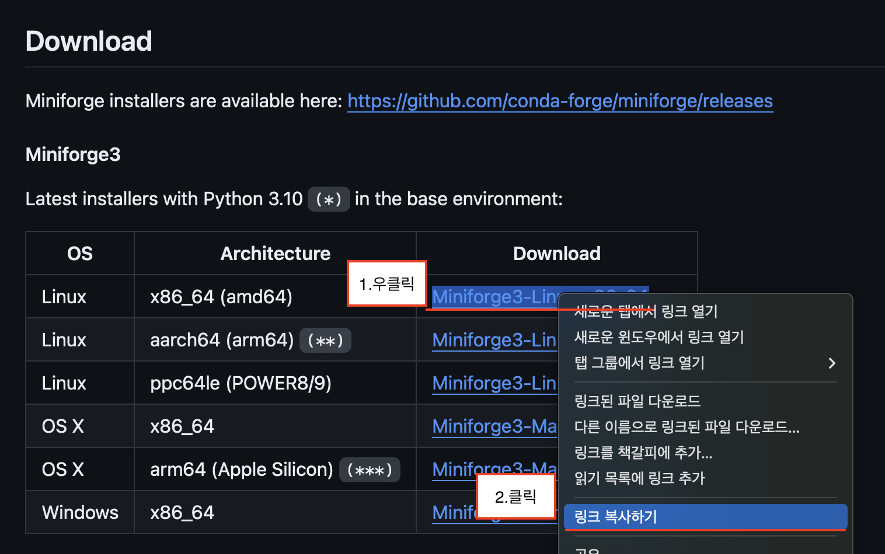

Container Guide
=========

Container 설치
---------

#### !!!아래 내용은 torch 1.10 + CUDA 11.3 을 예시로 들고 있음!!!

### 1. 연구에 중심으로 사용 될 라이브러리의 권장 환경 확인

##### 예시이미지\) detectron2 설치를 위한 documentation 내용

### 2. Docker Hub PyTorch 페이지에서 해당 태그 검색 및 명령어 복사

https://hub.docker.com/r/pytorch/pytorch/tags 

\

\
base, runtime, devel 중 원하는 환경 선택 **(runtime 권장)**

[참조] https://github.com/NVIDIA/nvidia-docker/wiki/CUDA#description

### 3. CLI 환경 (Terminal cmd 등)에서 서버 접속 (VPN 필요)
    ssh [계정]@114.110.***.***

### 4. 복사한 명령어 붙여넣기로 이미지 다운로드

    OSX : Ctrl+V
    Windows : Shift+Insert

### 5. 이미지 다운로드 확인

    docker images

### 6. 컨테이너 생성 및 실행
    docker run -it --gpus all --name [컨테이너 이름] [레포지토리]:[태그] /bin/bash
Tab으로 자동완성 가능 \
[옵션 참조] https://docs.docker.com/reference/cli/docker/container/run/

### 7. CUDA 확인
    $ python

    >>> import torch
    >>> torch.cuda.is_available()
    >>> True    # true 출력 확인
 

Pytorch Docker Image를 사용하였을 경우 아래 내용을 필수로 진행하여야 함

### [선택] Linux 환경 정리

#### 패키지 업데이트, vim, git 설치 

    apt update
    apt upgrade
    apt-get install sudo -y
    sudo apt update
    sudo apt upgrade
    sudo apt-get install vim git pip wget -y

#### vim 환경 세팅 저장
###### set 내용 복사 및 저장

    $ vi ~/.vimrc

    set number
    set ai
    set si
    set cindent
    set shiftwidth=4
    set expandtab
    set tabstop=4
    set softtabstop=4
    set ignorecase
    set hlsearch
    set nocompatible
    set autoindent
    set ruler
    set showmatch
    syntax on

#### bash tab 대소문자 무시
###### set 내용 복사 및 저장

    $ sudo vi /etc/inputrc

    set completion-ignore-case on

#### conda 설치

###### 선택1) Anaconda 설치 (작성자 추천)
https://www.anaconda.com/download 링크 하단에서 다운로드 링크 복사

    # for anaconda
    wget [Shift+Insert / Ctril+V]

###### 선택2) miniconda 설치
    # for miniconda
    wget https://repo.anaconda.com/miniconda/Miniconda3-latest-Linux-x86_64.sh

###### 선택3) Miniforge 설치
https://github.com/conda-forge/miniforge/?tab=readme-ov-file 링크 중 Download 탭

    # for miniforge
    wget [Shift+Insert / Ctrl+V]

이후 공통

    chmod +x [다운로드한 파일]
    ./[다운로드한 파일] -bu

    #After Installation
    conda init

설치 후 컨테이너 종료 후 재실행 필수

## 컨테이너 관리 명령어

### container 실행

    docker start [이름]

### container 접속

    docker attach [이름]

### container 탈출

    Ctrl + P -> Ctrl + Q

### container 종료

    내부에서: exit
    외부에서: docker stop [이름]

### 로컬 파일 서버로 복사

#### 추후 갱신 예정
https://filezilla-project.org

### container 외부파일 복사

    docker cp [피일명] [컨테이너ID]:[내부경로]

VS Code 서버 연결
---------
(작성예정)

\
\
\
\
참조
https://greeksharifa.github.io/references/2021/06/21/Docker/
\
\
\
변경사항

######    v1.0 &nbsp; &nbsp; &nbsp; 24.03.20 &nbsp;&nbsp; 최초 생성
######    v1.1 &nbsp; &nbsp; &nbsp; 24.03.20 &nbsp;&nbsp; 내용 수정
######    v1.2 &nbsp; &nbsp; &nbsp; 24.03.25 &nbsp;&nbsp; docker images 등 내용 추가
