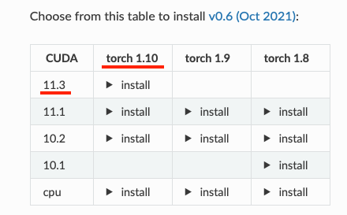
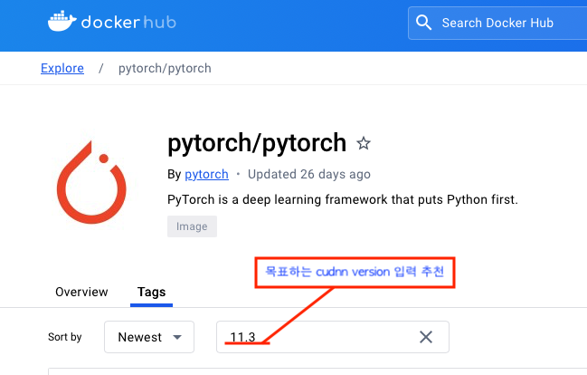
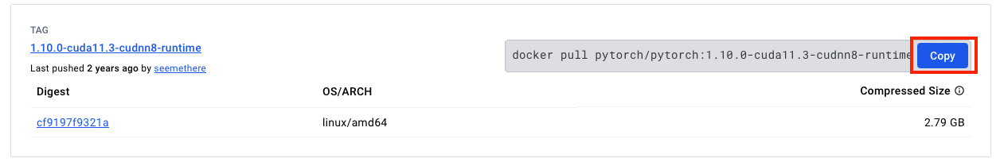

Container Guide
=========

Container 설치
---------

#### !!!아래 내용은 torch 1.10 + CUDA 11.3 을 예시로 들고 있음!!!

### 1. 연구에 중심으로 사용 될 라이브러리의 권장 환경 확인

##### 예시이미지\) detectron2 설치를 위한 documentation 내용

### 2. Docker Hub PyTorch 페이지에서 해당 태그 검색 및 명령어 복사

https://hub.docker.com/r/pytorch/pytorch/tags 

\

\
base, runtime, devel 중 원하는 환경 선택 **(runtime 권장)**

[참조] https://github.com/NVIDIA/nvidia-docker/wiki/CUDA#description

### 3. CLI 환경 (Terminal cmd 등)에서 서버 접속 (VPN 필요)
    ssh [계정]@114.110.130.222

### 4. 복사한 명령어 붙여넣기로 이미지 다운로드

    OSX : Ctrl+V / Windows : Shift+Insert 후 Enter

### 4. 컨테이너 생성 및 실행
    docker run -it --gpus all --name [컨테이너 이름] [레포지토리]:[태그] /bin/bash
[옵션 참조] https://docs.docker.com/reference/cli/docker/container/run/

### 5. CUDA 확인
    python

    >>> import torch
    >>> torch.cuda.is_available()
    >>> True    # true 출력 확인
 

### [선택] Linux 환경 정리

패키지 업데이트, vim, git 설치 
>   apt-get install sudo -y \
sudo apt update \
sudo apt upgrade \
sudo apt-get install vim git -y

vim 환경 세팅 저장
###### set 내용 복사 및 저장

>   vi ~/.vimrc
>   >   set number \
set ai \
set si \
set cindent \
set shiftwidth=4\
set expandtab\
set tabstop=4\
set softtabstop=4\
set ignorecase\
set hlsearch\
set nocompatible\
set autoindent\
set ruler\
set showmatch\
syntax on

bash tab 대소문자 무시
###### set 내용 복사 및 저장
>   sudo vi /etc/inputrc
>   >   set completion-ignore-case on

## 컨테이너 관리 명령어

### container 실행

    docker start [이름]

### container 접속

    docker attach [이름]

### container 탈출

    Ctrl + P -> Ctrl + Q

### container 종료

    내부에서: exit
    외부에서: docker stop [이름]

### container 외부파일 복사

    docker cp [피일명] [컨테이너ID]:[내부경로]

\
\
\
\
참조
https://greeksharifa.github.io/references/2021/06/21/Docker/
\
\
\
변경사항

######    v1.0 &nbsp; &nbsp; &nbsp; 24.03.20 &nbsp;&nbsp; 최초 생성
######    v1.1 &nbsp; &nbsp; &nbsp; 24.03.20 &nbsp;&nbsp; 내용 수정
